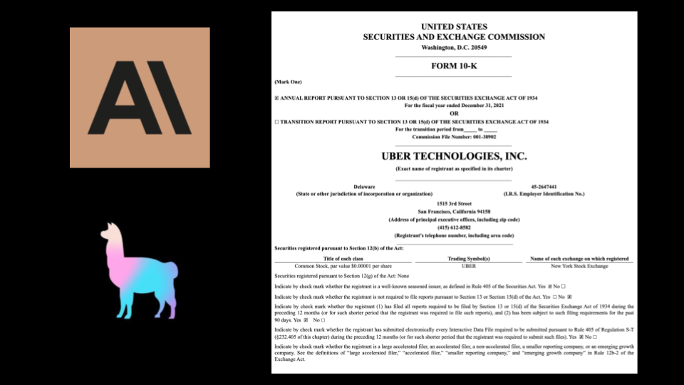

# SEC-API Filing LLM Analyzer


## Description

SEC-API Filing Analyzer is a Flask-based web application that automates the downloading of 10-K filing HTML files from the SEC-API database. It then performs text parsing to extract relevant pages based on targeted keywords. The extracted data is visualized using Matplotlib, and the application connects to the OpenAI API to provide AI-powered insight analysis.

## Features

- Automatic download of 10-K filing HTML files using *<ins>SEC-API</ins>*
- Text parsing to extract relevant pages based on targeted keywords using *<ins>BeautifulSoup</ins>*
- Visualization of extracted data using *<ins>Matplotlib</ins>*
- Integration with *<ins>OpenAI API</ins>* for AI-powered insight analysis
- User-friendly web interface built with *<ins>Flask</ins>*

## Choice of Text Analysis:
- Segmenting Operating Region<br><br>
This information provides insights into revenue sources, market exposure, risk diversification, and performance trends across different regions or business units. It can be well combined with market news that can aid in investment decision-making and risk assessment with outside information beyond 10-K filing.
  
- Revenue & Total Net Sales<br><br>
This information is the foundation of a company and shows directly of it's profitability trend, including financial health, growth trajectory, and market competitiveness. It provides insights into the company's core business activities, sales trends, customer demand, and overall revenue generation capabilities, which are crucial factors for evaluating investment opportunities and assessing financial performance.

## Acknowledgement

- Dynamic Visualizations:<br><br>
The static nature of visualizations in this application is due to potential SEC-API service failures. Dynamic visualizations can be implemented with additional parsing and efforts should it be necessary.

- Cloud Platform Deployment: <br><br>
I am capable of deploying this application on cloud platforms such as AWS and Azure if necessary for the research work. Feel free to reach out to me on this should it be necessary.

## [](https://youtu.be/W7QUwExZGa4) Demo Video 
<a href="https://youtu.be/W7QUwExZGa4">
  
</a>

## Installation

1. Clone the repository:

```bash
git clone https://github.com/PsyDak-Meng/Dak_AI_Station/tree/master/10-K_filing_LLM_Analyzer
```
2. Navigate to folder:
```bash
cd 10-K_filing_LLM_Analyzer
```
3. Install dependencies:
```bash
pip install -r requirements.txt
```
4. Run application:
```bash
python app.py
```


